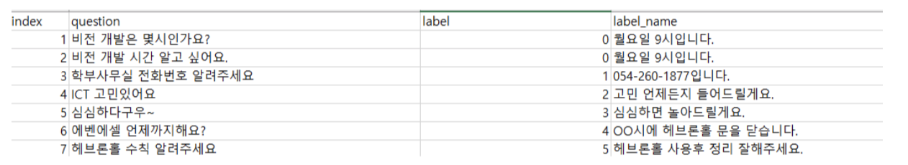
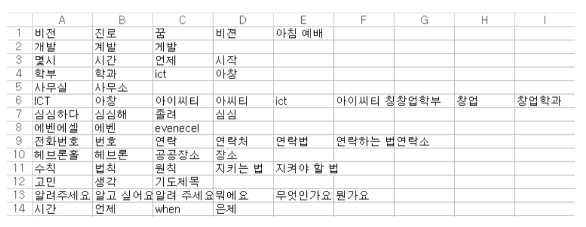
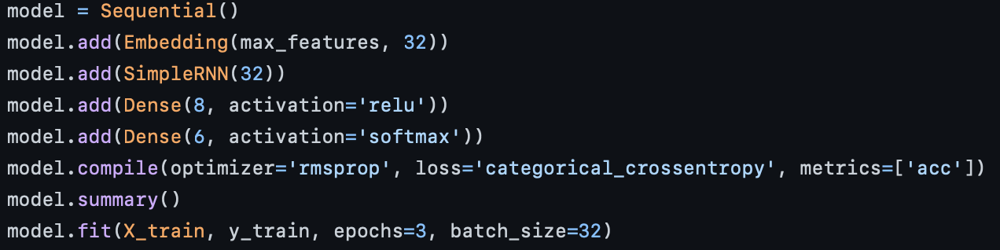
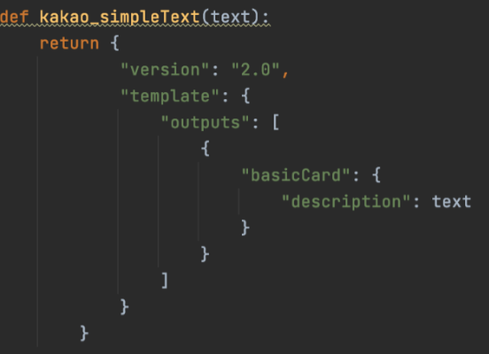
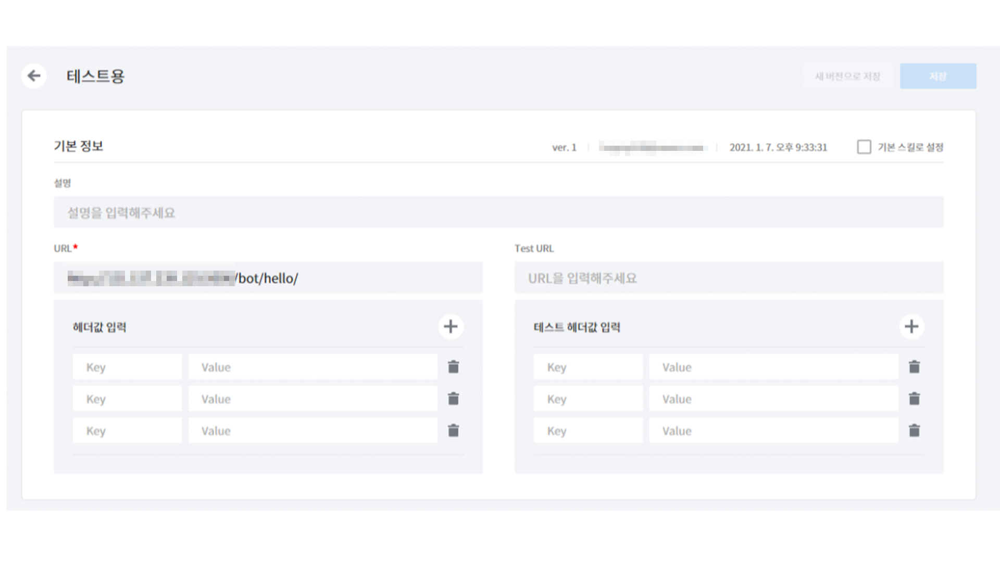
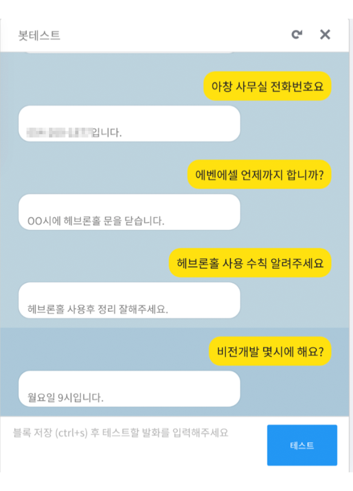

# Tensorflow RNN(Simple RNN)를 활용한 Kakao(Skill server) QA Chatbot Prototype 제작

## 1. 학습 데이터 생성

신경망 QA 학습을 위해서는 질문과 답변으로 라벨링되는 학습 데이터를 얻거나 제작해야 한다.
모범 답변(Answer)을 제작한 뒤 라벨링을 하고, 질문(Question)에 해당하는 모범 답변을 연결하는 방식의 데이터가 필요하다.

정확성을 높이기 위해서는 많은 데이터가 필요한데, 초기 프로토타입 개발 단계에서 수작업으로 많은 데이터를 생성하기에는 한계가 있었다.
따라서 학습 데이터를 자동적으로 생성할 수 있는 프로그램이 필요했다. 동의어 사전을 직접 제작하고 동의어 사전에 따라 예시 문장을 자동으로 제작하는 프로그램을 기획했다.
  
### <1> 동의어 사전 제작
본 챗봇의 프로토타입은 '학부'(한동대학교 ICT창업학부)를 위한 QA챗봇 형태로 기획했다. 학부의 대표 질문에 해당하는 동의어를 학부 사람들이 자주 사용하는 단어에서
추출하면 좋겠다는 생각이 들었다. Word2Vec은 단어 사이의 유사도를 계산할 수 있기에,
공개된 학부 단체 톡방에서 대화한 내용(비공개 파일 "ict_utf.txt")을 Word2Vec으로 학습한 뒤 예시 문장에서 등장하는 명사의 동의어를 추출해보았다.

code: <a href="https://github.com/hanwool95/Tenserflow_KaKao_chatbot_Prototype/blob/master/ict_tokenization.py">ict_tokenization.py</a>

추출한 동의어 이외에도 필요하다고 생각한 동의어를 추가해 csv파일로 정리하였다. 

"similar.csv"

### <2> 동의어 사전 기반 데이터 생성

'질문예시문장'과 '답변라벨'을 정리한 파일(비공개 파일 "proto1.csv")을 불러온 뒤, 
각 질문예시문장마다 similar.csv에 해당하는 단어가 있는지 확인 후 만약 존재한다면 새로운 학습 데이터로 제작하고 답변 라벨과 묶었다.
동의어가 여러개가 존재한다면 조합을 더 다양하게 섞도록 제작했다.

예를들어서 '나는 사과다'라는 문장이 있을 때 '나'라는 형태소 동의어 'me', 그리고 사과의 동의어 'apple'이 있으면  
'나는 사과다', 'me는 사과다', '나는 apple이다', 'me는 apple이다'라는 문장을 형성했다.

code: <a href="https://github.com/hanwool95/Tenserflow_KaKao_chatbot_Prototype/blob/master/create_data_from_dic.py">create_data_from_dic.py</a>

  

## 2. 신경망 구조 설계

신경망 학습은 token을 Sequential하게 처리가 가능한 RNN을 사용했다. 특히 GRU와 LSTM이 아닌 바닐라 RNN으로 사용했다. GRU와 LSTM은 sequence가 길어질 수록, 앞단 token의 값이 희미해져서 그 값을 기억하기 위해 나온 방법론인데,
챗봇의 질문 경우 보통 단답 형식으로 이루어지기에 바닐라 RNN으로도 충분하다는 생각이 들었다.

동의어사전으로 제작된 질문들과 답변라벨이 매칭된 파일(비공개 파일 "proto3.csv")을 불러와서 tokenization을 진행했다. 추출한 token은 pickle형태로 저장했다.  
신경망은 keras의 Sequential 객체를 이용해서 구성했다. Sequential은 단순하게 add를 이용해서 신경망 구조를 추가할 수 있으므로 간단한 프로토타입 제작에 유용하다.
  첫 번째 층에는 word embedding으로 token vector를 압축할 수 있는 층을 제작했고, 그 다음 층에는 SimpleRNN(바닐라 RNN)을 추가했다. 
바닐라 RNN의 activation은 0 이상의 값을 반환하는 relu를 이용했으며, label을 도출하는 activation은 multi label을 예측하는 softmax를 사용했다.  
code: <a href="https://github.com/hanwool95/Tenserflow_KaKao_chatbot_Prototype/blob/master/ict_RNN.py">ict_RNN.py</a>

  

## 3. 모델 카카오 챗봇 적용

챗봇 api 서버("/chatbot")는 Django로 구성했다.
신경망 학습으로 만들어진 token 정보("token.pickle")과 모델("ict_neural_model2.h5"), 그리고 답변 label numer 정보가 담겨 있는 파일("label.csv)를 manage.py가 있는 root에 옮겨놓았다.

###<1> module 제작

임의의 텍스트를 받았을 때 모델에 넣어서 알맞은 답변을 매칭하는 모듈을 제작해야 한다. 
자연어처리를 전담하는 하나의 객체를 만들어서 관리하기로 결정했다. 
"NLP"라는 자연어 처리 객체는 client에서 text를 보내줄 때 생성되며, 생성과 동시에 알맞은 답변 label을 model로부터 구한 뒤, label에 맞는 text를 연결한다. 

code: <a href="https://github.com/hanwool95/Tenserflow_KaKao_chatbot_Prototype/blob/master/chatbot/bot/module.py">chatbot/bot/module.py</a>

###<2> view 파일

카카오톡 오픈빌더 챗봇의 스킬서버는 json을 받고 json형태로 응답하는 방식으로 운영된다.
먼저 원하는 텍스트를 단순한 답변 채팅으로 변환할 수 있는 함수를 제작했고, 이것을 장고가 제공해주는 JsonResponse로 내보냈다.

Client의 request를 받으면 모듈에서 제작한 NLP 객체에 client Question을 넣어서 답변을 생성하고, 그 답변을 그대로 Response하는 방식으로 제작했다.

code: <a href="https://github.com/hanwool95/Tenserflow_KaKao_chatbot_Prototype/blob/master/chatbot/bot/views.py">chatbot/bot/views.py</a>

###<3> 연결과 동작

AWS EC2에 서버를 배포하여 작동시키고, 카카오 오픈빌더에서 주소를 연결시키면 챗봇이 정상적으로 동작한다.

